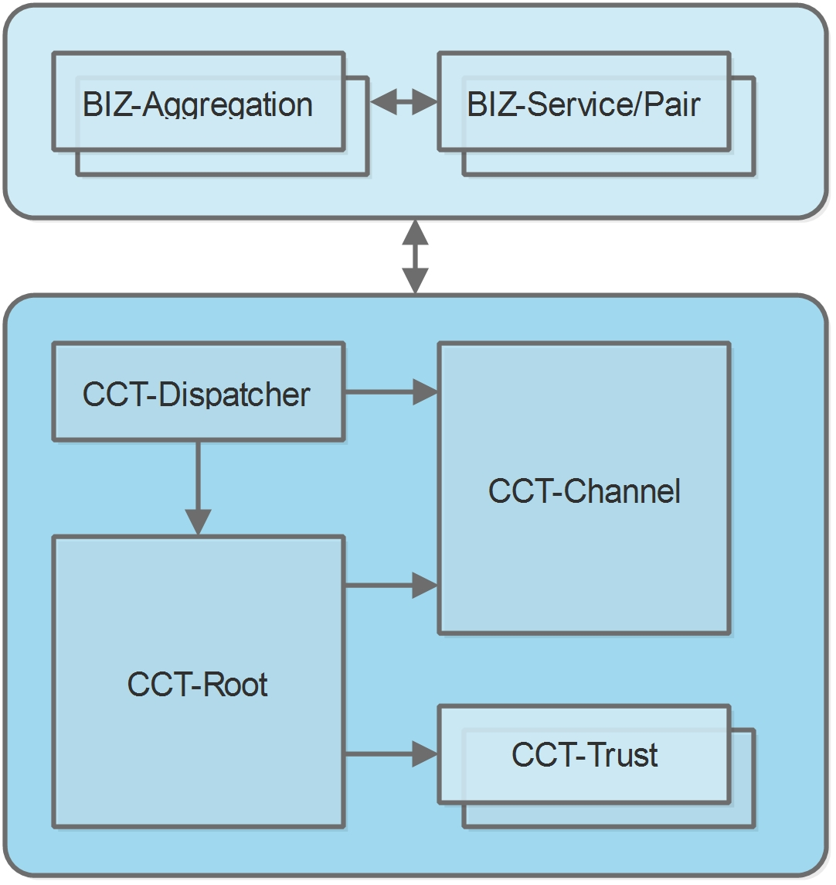

# T-Bridge-Contracts
The contracts for Wanchain 4.0 T-Bridge framework

# Introduction

With T-Bridge framework, Cross-Chain Transactions (CCT) contracts and sample business contracts have been provided for the CCT transactions.

For the sample scenario, Wanchain blockchain and HyperLedger BESU blockchain have been connected. Here HyperLedger BESU plays the role of private and business blockchain. Wanchain plays the role of public and router blockchain.

For the sample scenaio, user owns the WRC20 token. Two cases are supported:

1. User shall be able to use the exchange service to exchange WRC20 token to B token in BESU, and pay the exchanged B token to others. 
2. User shall be able to use the exchange service to exchange WRC20 token to B token in BESU, and buy the goods published in BESU. 
 
For new CCT scenarios, additional business contracts could be developed accordingly.

# Deployment

For Wanchain mainnet, relevant contracts have been deployed:

- CCTRoot: 0x918aef7a61091b7f37f0a696fe4e92d1df0ce7d3
- CCTTrustTest: 0x3c11d554f6475d833de2c71925d07a5eae679dca
- CCTChannel: 0x4bb4a5c44dfaffa4a8422e6eb7c5a31d170c4591
- CCTDispatcher: 0x7f86e361602078506e0ebcb1af5801b7b3a33d25
- AggregationWan: 0xd31d31c6928b67bb2ace7b1fce799d5550476f31
- ExchangeProxy: 0x021e6e7a08379021ba4909812f004887b4b0a51f
- GoodsProxy: 0x91ccae97293d73be4278c9706fdb99c8308aafcb
- Wrch: 0xae6465d572a9a0cc585009a0df50edc95b695129
- DemoERC20: 0x1e3859494a66181054fdfccc88bed12ee50df155

For private BESU mainnet, relevant contracts have been deployed:

- CCTRoot: 0xef8292aa6bba7f6411da68e05a8992439c03bbed
- CCTTrustTest: 0xaf1b541f2ada5d44949fe3cae7dc03658fd0eaf5
- CCTChannel: 0xb2c3198071e8c035a2713b6788eea57e0aa6b0cf
- CCTDispatcher: 0x343d35b8d29b5e9a70d01c2c3d32c4c42fc9c5e0
- Aggregation: 0x5a3d185a1ea3ea2ac6a2255ce1b41d9548f2b565
- Exchange: 0x68883dc3c15591f38098d76133ea92ca2852ea0d
- Goods: 0x7098ec23f144c9275eba871e1306cd1dc9194e20
- ERC20B: 0x999ff7352de5c4f0d996d8571842ca576eb23523
